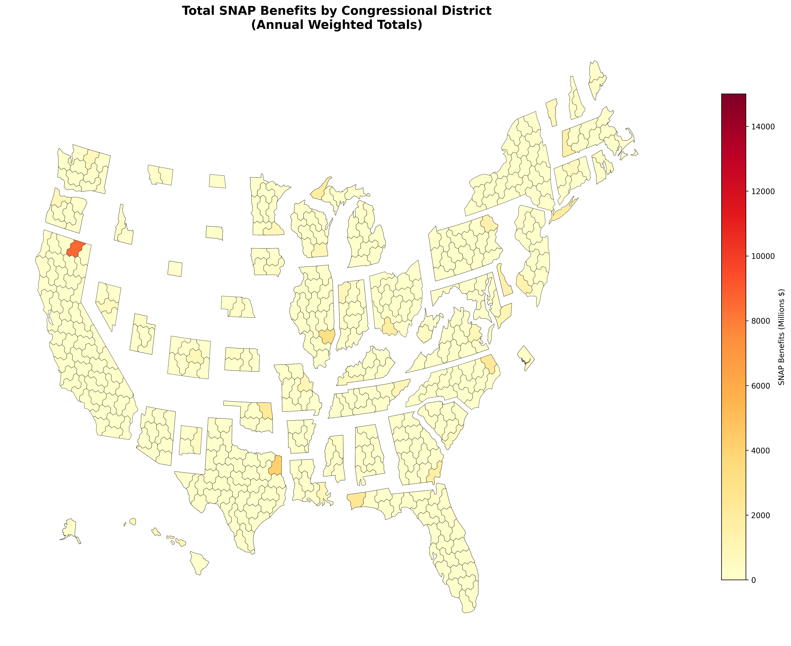

# SNAP Benefits by Congressional District



## Overview

Survey-weighted estimates of total SNAP benefits by congressional district across all 50 states plus DC.

**Total SNAP Benefits: $94 billion**

## Prerequisites

```bash
uv pip install policyengine-us pandas --python ~/envs/pe/bin/python
```

## Running the Code

```bash
cd /home/baogorek/devl/code-snippets/calculation/snap
~/envs/pe/bin/python snap_districts.py
```

**Output:** `snap_by_congressional_district.csv`

## Data

- **Source:** PolicyEngine US microsimulation data (state-level .h5 files)
- **Districts:** 725 congressional districts
- **Variables:** household_id, household_weight, congressional_district_geoid, snap

## Results

### Top States by SNAP Benefits

| State | Total Benefits |
|-------|----------------|
| AL    | $15.1B         |
| AZ    | $14.7B         |
| CA    | $8.6B          |
| AK    | $5.5B          |
| AR    | $4.6B          |

### Top Districts by SNAP Benefits

| District | State | Total Benefits |
|----------|-------|----------------|
| 1001     | AL    | $15.0B         |
| 4001     | AZ    | $14.6B         |
| 601      | CA    | $8.6B          |
| 2001     | AK    | $5.0B          |
| 5001     | AR    | $4.5B          |

## Visualization

For map visualization code, see: `/home/baogorek/devl/Congressional-Hackathon-2025/PolicyEngine/plot_snap_impacts.py`
